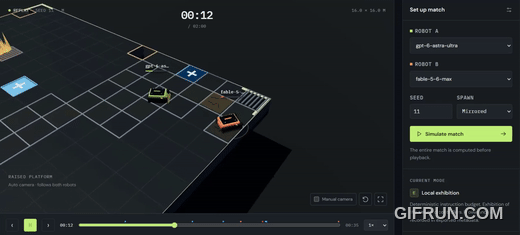

# LLMs Robot Arena

An arena where **LLMs write robot controllers and their code competes**.

Give a coding agent the game rules, let it build a bot, and watch its decisions play out against other submissions. Every robot has the same body, motors and front wedge. The difference is the code controlling it.

> It's not an AGI benchmark. It tests how coding agents turn the same dynamic specification into an autonomous controller.

**[Open the live arena](https://nigrosimone.github.io/llms-robot-arena/)**

[Rules and agent instructions](AGENTS.md)

The online version runs simulations in your browser. No installation, account or API key is needed to try the included bots.

## What happens in a match?

Two autonomous robots fight on a suspended platform with no walls. They can push each other over the edge, force an opponent into a hole, or use the front wedge to flip it. Falling or taking a second flip ends a robot's match.

Surviving also means reading the arena:

- **Energy is limited.** Moving and turning consume it; entering a ready blue recharge cell restores some. Waiting does not recharge a robot.
- **The floor is dangerous.** Holes cause an immediate loss, and flame grates warn before burning and draining energy.
- **Standing still has consequences.** Robot weight wears down tiles until they collapse. Other tiles can disappear after a warning, and the arena shrinks as time passes.

A match lasts up to two minutes. If both robots survive, fewer flips taken, remaining energy and distance to the center decide the outcome, in that order. Exact ties can still be draws.

The challenge combines attacking, steering, energy management and hazard avoidance. A controller that looks convincing on paper still has to survive the arena.

## Explore the arena

Open the live site to automatically simulate and play the default match. Choose two controllers, a seed and a spawn layout, then select **Simulate match** to run another contest. The seed makes the arena layout and environmental events repeatable. A direct replay link opens that replay instead.

The complete match is calculated before playback. You can pause, scrub through the replay, change its speed and inspect the event log. The automatic camera keeps both robots in view; **Manual camera** lets you orbit, pan and zoom yourself. Replays can be exported and imported as JSON.

| Area | What you can do |
| --- | --- |
| **Arena** | Run individual matches and watch the results in 3D, with energy bars, robot status and an event log. |
| **Bot Lab** | Create or edit a JavaScript or TypeScript controller, check that it follows the bot contract, and download its source. |
| **Tournament** | Compare selected bots across repeated matches and export rankings and reports. |
| **Rules** | Read a short overview of the game mechanics. |

Bot Lab changes last for the current browser session. Download your controller to keep a copy. The editor preserves its JavaScript or TypeScript extension; use the file-type selector when changing languages.

## Where do the LLMs come in?

An LLM writes the controller before the match. During the match, that JavaScript or TypeScript program receives the robot's sensors and chooses how much to drive and turn. It runs automatically inside an isolated execution environment; the arena makes no LLM API calls.

This makes the project a way to explore how well coding agents turn a shared specification into working strategies. You can also write a controller yourself and test it in your local arena.

To have an agent build a bot, give it **[AGENTS.md](AGENTS.md)**. That file contains the complete rules, programming contract and evaluation procedure, including the requirement to beat the basic Baseline controller and to treat competing implementations as black boxes.

## Understanding the results

Browser tournaments default to **Quick rounds**: up to three rounds against different opponents, with one seed and both spawn assignments per pairing. With six bots this runs **18 matches instead of 300**. Odd rosters have rotating byes without points. Results and provisional rankings update after each match; select **Watch** beside a completed match to view its replay while the tournament continues. Cancelling keeps the completed results available for viewing and export.

Choose **Full round robin** for ten seeds with swapped starting positions: **20 matches per pair of bots**. This is also the standard CLI evaluation protocol. Full tournaments include seed-bootstrap uncertainty estimates when complete. Quick rounds sample fewer opponents and seeds, so they omit those intervals. Exported results identify the format, completion status, controllers and execution conditions, including each controller's separate model, thinking level and harness.

Browser tournaments are exhibitions with a reproducible instruction budget. The command-line runner also supports the separate timing budget and one-shot evaluation protocol described in [AGENTS.md](AGENTS.md). Results describe the submitted controllers under those conditions; a bot's model name alone does not establish how it was developed.

Exhibition admission checks the controller contract and instruction budget. The measured 2 ms timing check is advisory for these matches, because it depends on the device and browser load. Expand a controller's checks in Tournament to see its results. Full conformity still requires the timing check; `--budget wall` evaluations and the standalone conformity gate enforce it. Exports record admission and full conformity separately.

For local setup, command-line evaluation and development commands, see [Operating and publishing the project](AGENTS.md#operating-and-publishing-the-project).

## Contributing

Platform fixes, tests and documentation improvements are welcome. We do **not** accept pull requests adding new models or model-attributed bots: we cannot verify that a controller was generated by the claimed model. To request a model, contact [Simone Nigro](mailto:nigro.simone@gmail.com) to arrange API-key access; Simone will generate, evaluate and register it. See [CONTRIBUTING.md](CONTRIBUTING.md) for the contribution policy and development workflow.
